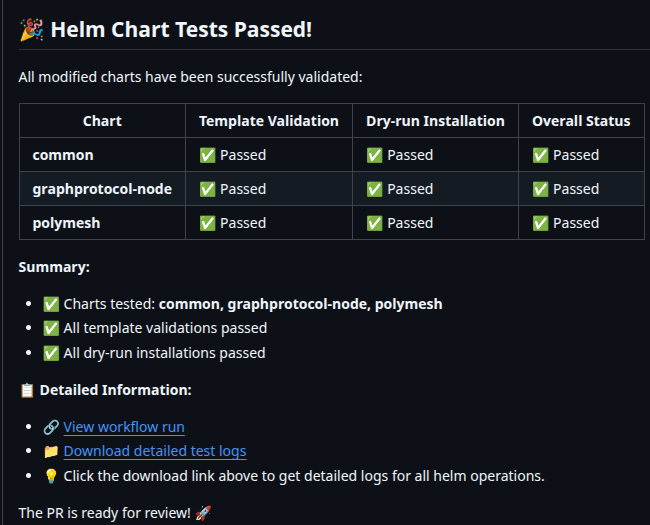
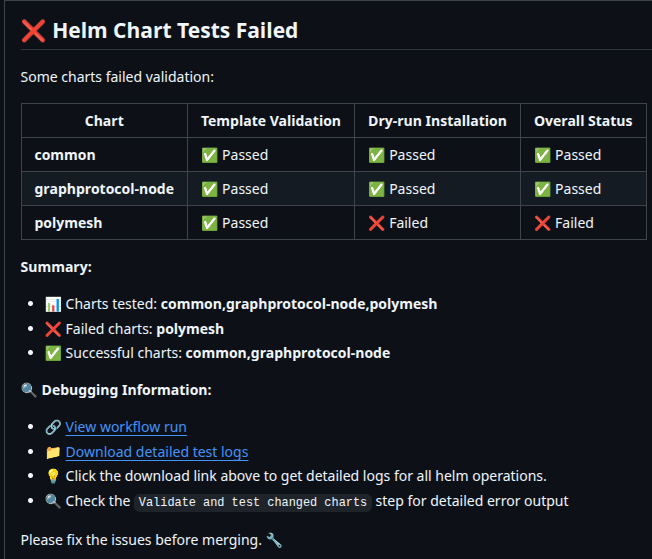
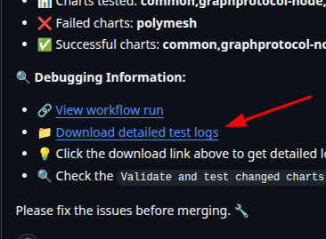
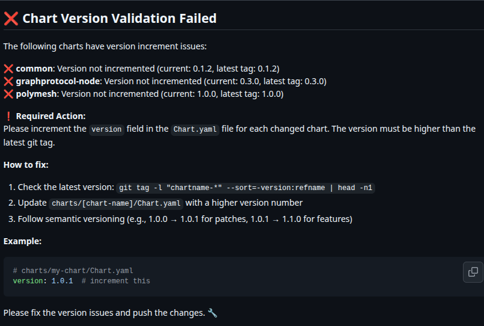
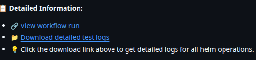
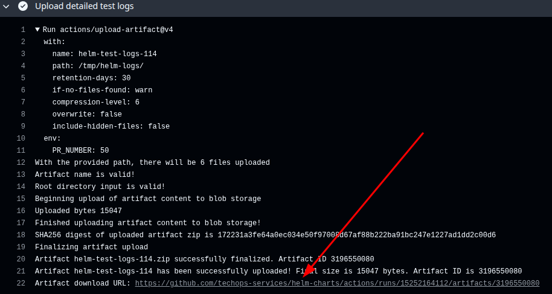

# Helm Charts Repository

Repository to use: "https://techops-services.github.io/helm-charts"

This repository contains Helm charts that are automatically released to GitHub Pages using GitHub Actions. The charts are tested, validated, and published automatically when changes are made via pull requests.

## 📑 Table of Contents

- [📋 Repository Purpose](#-repository-purpose)
- [🔄 Automated Pipeline Overview](#-automated-pipeline-overview)
- [📝 Test Values Requirement](#-test-values-requirement)
- [📊 Interpreting Test Results](#-interpreting-test-results)
- [🔧 Troubleshooting Failed Checks](#-troubleshooting-failed-checks)
  - [Template Validation Failures](#template-validation-failures)
  - [Dry-run Installation Failures](#dry-run-installation-failures)
  - [Version Increment Failures](#version-increment-failures)
- [📁 Accessing Detailed Logs](#-accessing-detailed-logs)
- [🚀 Chart Development Workflow](#-chart-development-workflow)
- [📖 Using Published Charts](#-using-published-charts)
- [💡 Best Practices](#-best-practices)
- [🔍 Pipeline Configuration](#-pipeline-configuration)


## 📋 Repository Purpose

This repository serves as a **Helm chart registry** that:
- Hosts Helm charts for Kubernetes applications
- Automatically validates and tests charts on every pull request
- Publishes charts to GitHub Pages using [chart-releaser](https://github.com/helm/chart-releaser)
- Provides automated version management and release notes
- Ensures chart quality through comprehensive testing

The published charts are available at: `https://[your-username].github.io/[repository-name]/`

## 🔄 Automated Pipeline Overview

The GitHub Actions pipeline (`Release Charts`) automatically triggers on pull requests to the `main` branch and performs the following steps:

### 1. **Change Detection**
- Scans the `charts/` directory to identify which charts have been modified
- Only tests and processes charts that have actual changes
- Skips pipeline execution if no chart changes are detected

### 2. **Chart Validation & Testing**
For each modified chart, the pipeline performs:
- **Template Validation**: Runs `helm template` to ensure YAML templates are syntactically correct
- **Dry-run Installation**: Performs `helm install --dry-run` to validate Kubernetes resource generation
- **Version Increment Check**: Ensures chart versions are properly incremented compared to existing releases

### 3. **Automated Release**
- Creates GitHub releases for successfully validated charts
- Generates and updates the Helm repository index
- Publishes charts to GitHub Pages for public consumption

## 📝 Test Values Requirement

**Each chart MUST include a `test-values.yaml` file** in its root directory (`charts/[chart-name]/test-values.yaml`).

### Purpose of test-values.yaml
This file provides test-specific configuration that allows the pipeline to:
- Validate template rendering with realistic values
- Test dry-run installations without external dependencies
- Ensure charts work with various configuration scenarios

### Content Guidelines
The `test-values.yaml` should contain:

```yaml
# Example test-values.yaml
# Use test/mock data instead of production values
image:
  repository: nginx  # Use public images for testing
  tag: "1.21-alpine"
  pullPolicy: IfNotPresent

service:
  type: ClusterIP
  port: 80

ingress:
  enabled: false  # Disable complex ingress for testing

# Use test-specific names/namespaces
fullnameOverride: "test-app"
nameOverride: "test"

# Disable or mock external dependencies
database:
  enabled: false
  # Or use test database settings
  host: "test-db.example.com"
  port: 5432
  name: "testdb"

# Use minimal resource requirements for testing
resources:
  limits:
    cpu: 100m
    memory: 128Mi
  requests:
    cpu: 50m
    memory: 64Mi

# Disable persistence for testing
persistence:
  enabled: false
```

### Creating test-values.yaml
1. **Start with your main `values.yaml`** as a template
2. **Replace production values** with test-friendly alternatives:
   - Use public Docker images instead of private ones
   - Use test database connections or disable external services
   - Set minimal resource requirements
   - Disable complex features like ingress, persistence, or monitoring
3. **Ensure the chart can render and install** with these values in a clean Kubernetes cluster

## 📊 Interpreting Test Results

The pipeline posts detailed results as PR comments. Here's how to interpret them:

### ✅ Success Example

### ❌ Failure Example  

### Test Results Table
The pipeline generates a results table showing:

| Chart | Template Validation | Dry-run Installation | Overall Status |
|-------|-------------------|---------------------|----------------|
| **my-chart** | ✅ Passed | ✅ Passed | ✅ Passed |
| **another-chart** | ❌ Failed | - | ❌ Failed |

- **Template Validation**: Whether `helm template` succeeded
- **Dry-run Installation**: Whether `helm install --dry-run` succeeded  
- **Overall Status**: Combined result of all tests

## 🔧 Troubleshooting Failed Checks

### Template Validation Failures

**Symptoms:**
- ❌ Template validation shows "Failed" 
- Error messages about YAML syntax or missing values

**Common Causes & Solutions:**

1. **Missing required values in test-values.yaml**
   ```yaml
   # Add missing required values
   database:
     host: "required-value"
     port: 5432
   ```

2. **Invalid YAML syntax in templates**
   - Check for proper indentation
   - Ensure all quotes are properly closed
   - Validate template logic (`{{ if }}`, `{{ range }}`, etc.)

3. **Undefined template functions**
   - Ensure all custom template functions are defined
   - Check for typos in template function names

**Finding Logs:**


1. Check the PR comment for the "📁 Download detailed test logs" link
2. Download the `helm-test-logs-[run-number]` artifact
3. Look at `[chart-name]-template.log` for detailed error output

### Dry-run Installation Failures

**Symptoms:**
- ✅ Template validation passed
- ❌ Dry-run installation failed

**Common Causes & Solutions:**

1. **Kubernetes resource conflicts**
   - Conflicting resource names
   - Invalid Kubernetes API versions
   - Missing required labels or annotations

2. **Resource dependencies**
   - References to non-existent ConfigMaps/Secrets
   - Invalid service account references
   - Missing RBAC permissions

3. **Invalid resource specifications**
   - Incorrect resource quotas
   - Invalid container specifications
   - Malformed environment variables

**Finding Logs:**
1. Download the test logs artifact from the PR comment
2. Check `[chart-name]-dryrun.log` for detailed Kubernetes validation errors

### Version Increment Failures

**Symptoms:**
- ❌ Chart Version Validation Failed
- Error about version not being incremented

**Solution:**
1. Check the current version in your `Chart.yaml`:
   ```yaml
   version: 1.0.0  # This needs to be incremented
   ```

2. Find the latest released version:
   ```bash
   git tag -l "my-chart-*" --sort=-version:refname | head -n1
   ```

3. Increment the version following [semantic versioning](https://semver.org/):
   - **Patch** (1.0.0 → 1.0.1): Bug fixes
   - **Minor** (1.0.1 → 1.1.0): New features, backward compatible
   - **Major** (1.1.0 → 2.0.0): Breaking changes



## 📁 Accessing Detailed Logs

When tests fail, the pipeline generates detailed logs that are essential for debugging:

### Via PR Comments


1. **Look for the test results comment** on your PR
2. **Find the "📁 Download detailed test logs" link**
3. **Click the link** to download the artifact

### Via GitHub Actions


1. **Navigate to the failed workflow run**
2. **Scroll to the "Artifacts" section** at the bottom
3. **Download `helm-test-logs-[run-number]`**

### Log Files Included
The artifact contains:
- `[chart-name]-template.log`: Full output from `helm template` command
- `[chart-name]-dryrun.log`: Full output from `helm install --dry-run` command

## 🚀 Chart Development Workflow

### 1. Create/Modify Chart
```bash
# Create new chart
helm create charts/my-new-chart

# Or modify existing chart
cd charts/existing-chart
# Make your changes...
```

### 2. Create test-values.yaml
```bash
# Copy and modify values for testing
cp charts/my-chart/values.yaml charts/my-chart/test-values.yaml
# Edit test-values.yaml with test-appropriate values
```

### 3. Test Locally (Recommended)
```bash
# Validate template rendering
helm template my-chart charts/my-chart -f charts/my-chart/test-values.yaml

# Test dry-run installation
helm install my-chart charts/my-chart \
  -f charts/my-chart/test-values.yaml \
  --dry-run --debug
```

### 4. Increment Version
```bash
# Edit Chart.yaml
vim charts/my-chart/Chart.yaml
# Increment the version field
```

### 5. Create Pull Request
- Push changes to a feature branch
- Create PR to `main` branch
- Wait for automated tests to complete
- Address any failures using the troubleshooting guide above

### 6. Merge & Release
- Once all tests pass, merge the PR
- Charts are automatically released to GitHub Pages
- New chart versions become available in the Helm repository

## 📖 Using Published Charts

After charts are successfully released, you can use them:

```bash
# Add the repository
helm repo add my-charts https://[username].github.io/[repository-name]/

# Update repository
helm repo update

# Install a chart
helm install my-release my-charts/my-chart
```

## 💡 Best Practices

1. **Always test locally** before creating a PR
2. **Use meaningful commit messages** that describe chart changes
3. **Follow semantic versioning** for chart versions
4. **Keep test-values.yaml minimal** but functional
5. **Document breaking changes** in chart README files
6. **Test with different Kubernetes versions** when possible

## 🔍 Pipeline Configuration

The pipeline is configured in `.github/workflows/release-charts.yml` and:
- Runs on Ubuntu latest with Minikube
- Uses Helm 3.x
- Tests against stable Kubernetes version
- Retains test logs for 30 days
- Requires specific permissions for releases

For pipeline modifications, ensure you understand the security implications and test thoroughly in a fork first.
